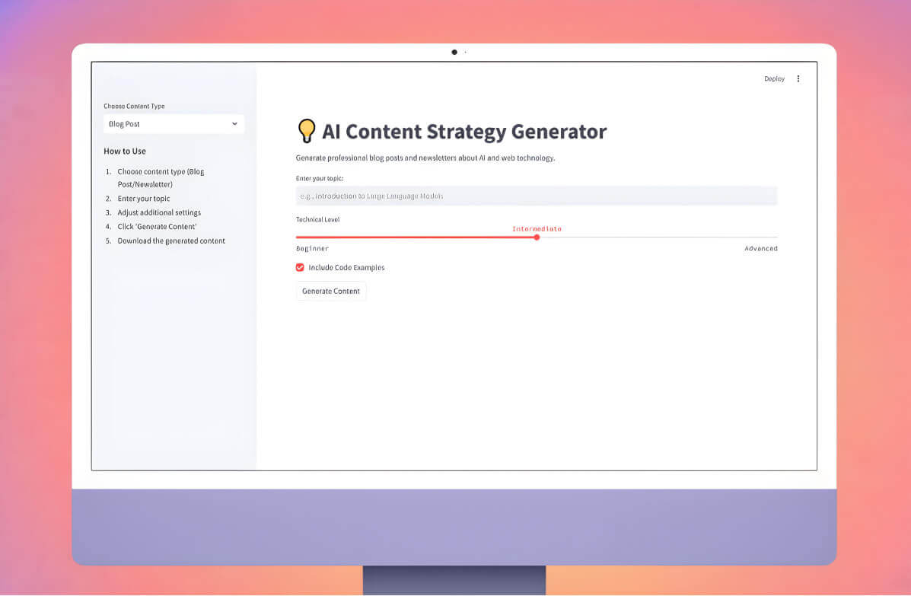

# 📄 AI Content Strategy Generator

This is a **Streamlit application** that uses **Google AI Studio's Gemini API** to generate professional blog posts and newsletters on **AI, LLMs, and web technology**. The app allows users to customize content type, technical depth, and structure, ensuring high-quality, engaging content.

## 🚀 Features
- **Generate Blog Posts** with adjustable technical levels and optional code examples.
- **Create Technical Newsletters** with customizable sections.
- **Interactive UI** powered by **Streamlit**.
- **Downloadable Content** in markdown format.
- **Secure API Integration** using environment variables.

## 📌 Prerequisites
Ensure you have the following installed:
- Python 3.8+
- Streamlit
- Google AI SDK (`google-generativeai`)
- dotenv for environment variable management

## 🤝 Contributing
Feel free to fork this repository and submit pull requests with improvements!

## 📬 Contact
For questions or suggestions, reach out via [your email] or open an issue on GitHub.

---
✨ **Built with Streamlit and Google Gemini API** ✨
